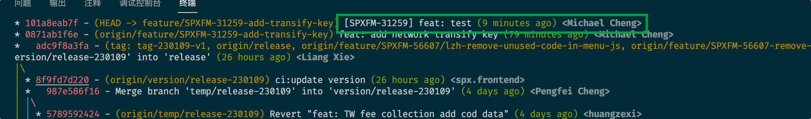
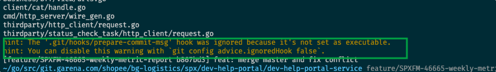

## 常规使用方式

```sh
echo '# add jira number
# $1 and $2 defined by Git
COMMIT_MSG_FILE=$1
COMMIT_TYPE=$2

# You can update this variable to your JIRA projects in REGEXP format.
JIRA_PROJECT="(SPXFM|SPSERP)"

CURRENT_BRANCH=$(git symbolic-ref --short -q HEAD)                     # Get current branch name
JIRA_TAG=$(echo ${CURRENT_BRANCH} | egrep -o "${JIRA_PROJECT}-[0-9]+") # Parse JIRA ID from branch name

# Write JIRA ID as the prefix of the first line of commit message.
if [ -n "${JIRA_TAG}" ]; then
  if ! head -1 ${COMMIT_MSG_FILE} | egrep -i "${JIRA_TAG}" >/dev/null; then # Not write JIRA ID if already has.
    sed -in-place -e "1s/^/[${JIRA_TAG}] /1" "${COMMIT_MSG_FILE}"
  fi
fi' >> ./.git/hooks/prepare-commit-msg
```

直接复制上面的命令在项目根目录执行。将为项目中的每个 commit 自动带上 jira 号。

commit 的效果如下：


## 使用 submodules 的方式

```sh
echo '# add jira number
# $1 and $2 defined by Git
COMMIT_MSG_FILE=$1
COMMIT_TYPE=$2

# You can update this variable to your JIRA projects in REGEXP format.
JIRA_PROJECT="(SPXFM|SPSERP)"

CURRENT_BRANCH=$(git symbolic-ref --short -q HEAD)                     # Get current branch name
JIRA_TAG=$(echo ${CURRENT_BRANCH} | egrep -o "${JIRA_PROJECT}-[0-9]+") # Parse JIRA ID from branch name

# Write JIRA ID as the prefix of the first line of commit message.
if [ -n "${JIRA_TAG}" ]; then
  if ! head -1 ${COMMIT_MSG_FILE} | egrep -i "${JIRA_TAG}" >/dev/null; then # Not write JIRA ID if already has.
    sed -in-place -e "1s/^/[${JIRA_TAG}] /1" "${COMMIT_MSG_FILE}"
  fi
fi' >> ./.git/modules/line-haul/hooks/prepare-commit-msg

```

## 问题

某些项目可能本身不存在 prepare-commit-msg 文件，这时使用上述命令会新增一个 prepare-commit-msg 文件，你需要修改该文件的执行权限。


> hint: The '.git/hooks/prepare-commit-msg' hook was ignored because it's not set as executable.
hint: You can disable this warning with `git config advice.ignoredHook false`.

使用下面的命令修改权限

```bash
chmod +x ./.git/hooks/prepare-commit-msg
```